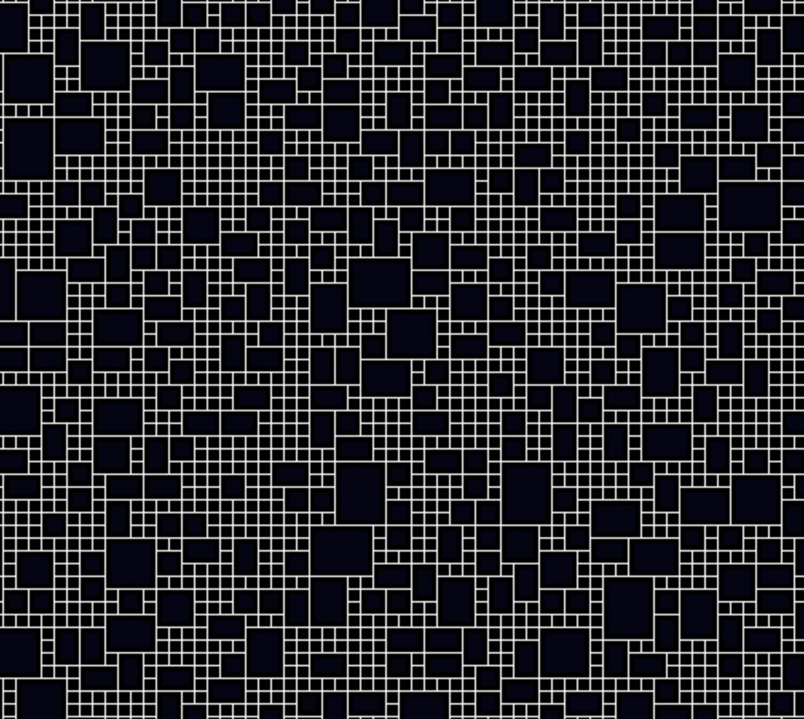

# Tile Grid Maker

## View live here: https://ignight-dev.github.io/grid-cellularization/

Generates maps like this:

Simple algorith to make a grid of rectangular-shaped tiles that tile a grid

Idea is to use this for map making

